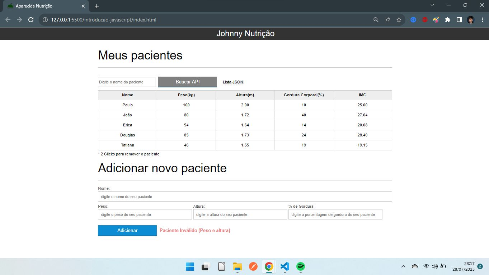

# Nutritionist Client Management System

Welcome to the Nutritionist Client Management System repository! This web application allows a nutritionist to manage a list of clients, perform CRUD operations, and automatically calculate the Body Mass Index (BMI) for each client.



## Features

- Create, Read, Update, and Delete clients
- Automatic BMI calculation
- User-friendly interface

## Technologies Used

- HTML
- JavaScript
- CSS

## Getting Started

To run the web application locally, follow these steps:

1. Clone the repository:

   ```bash
   git clone https://github.com/your-username/nutritionist-client-management.git
